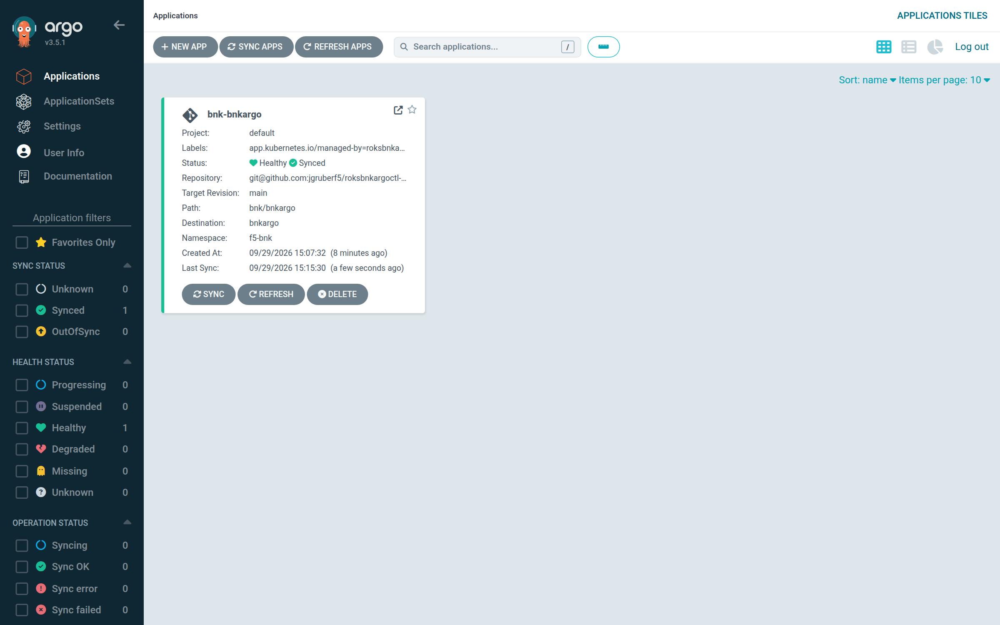
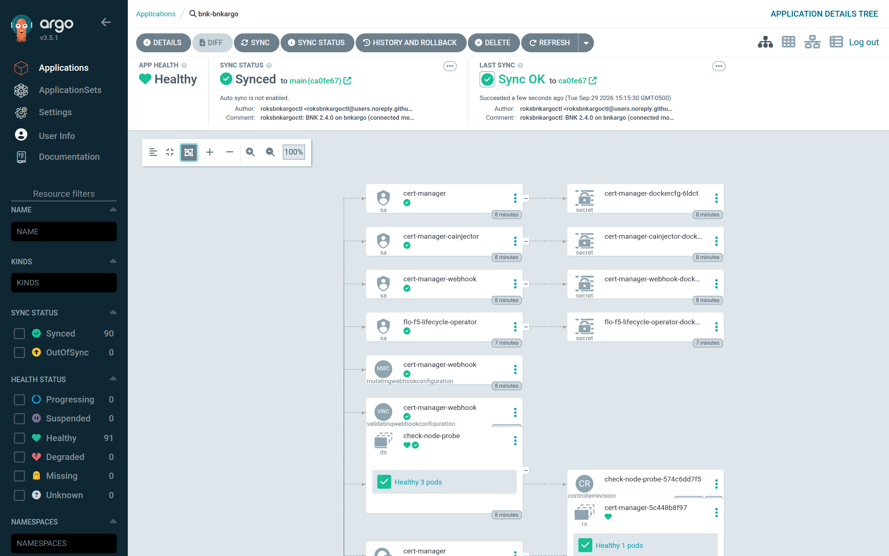
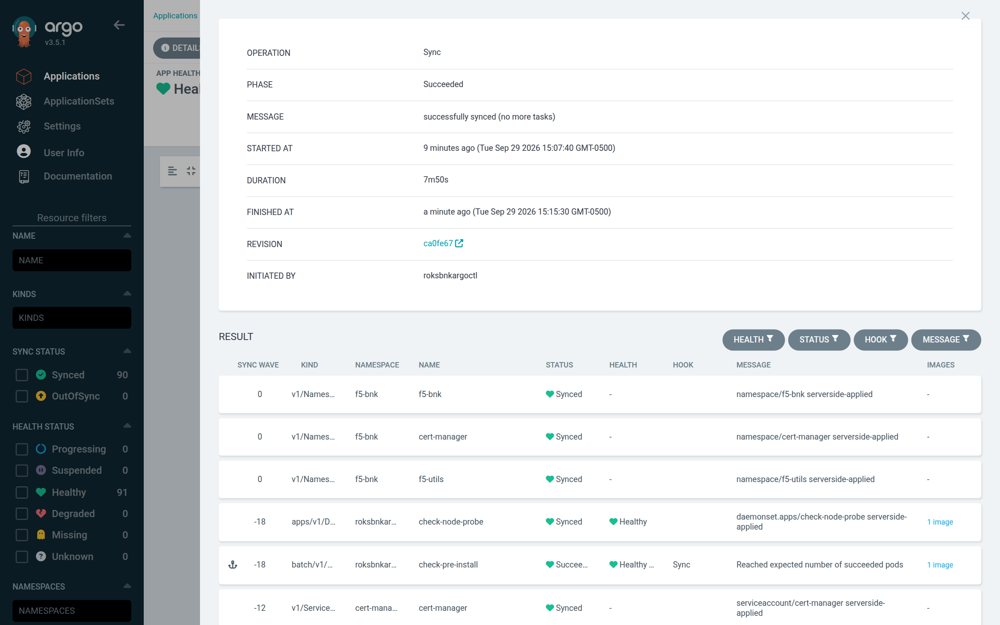
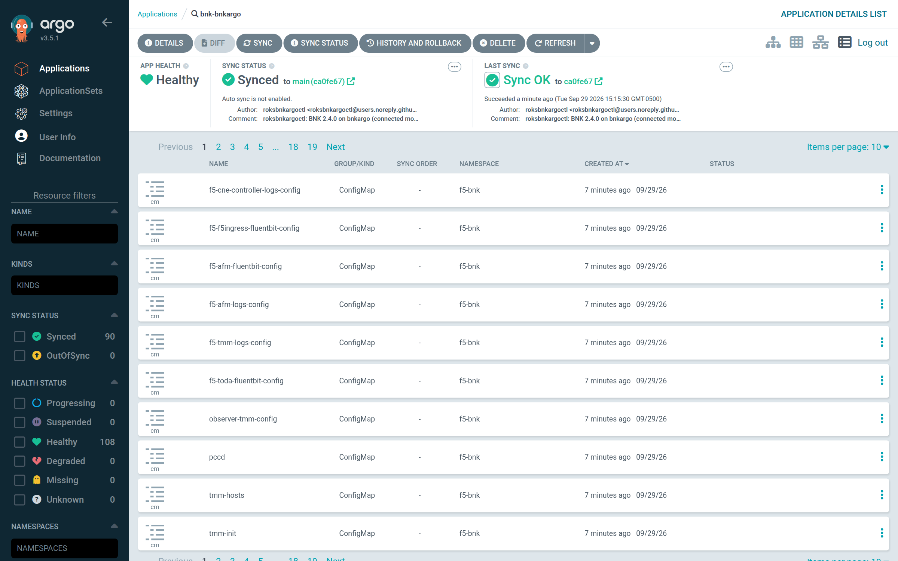
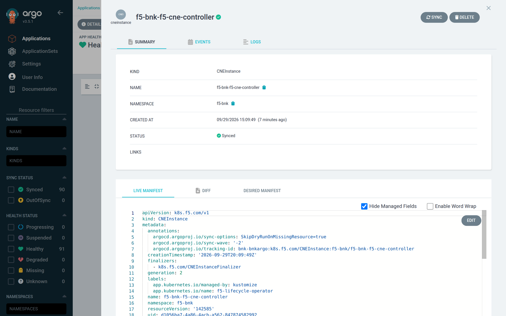
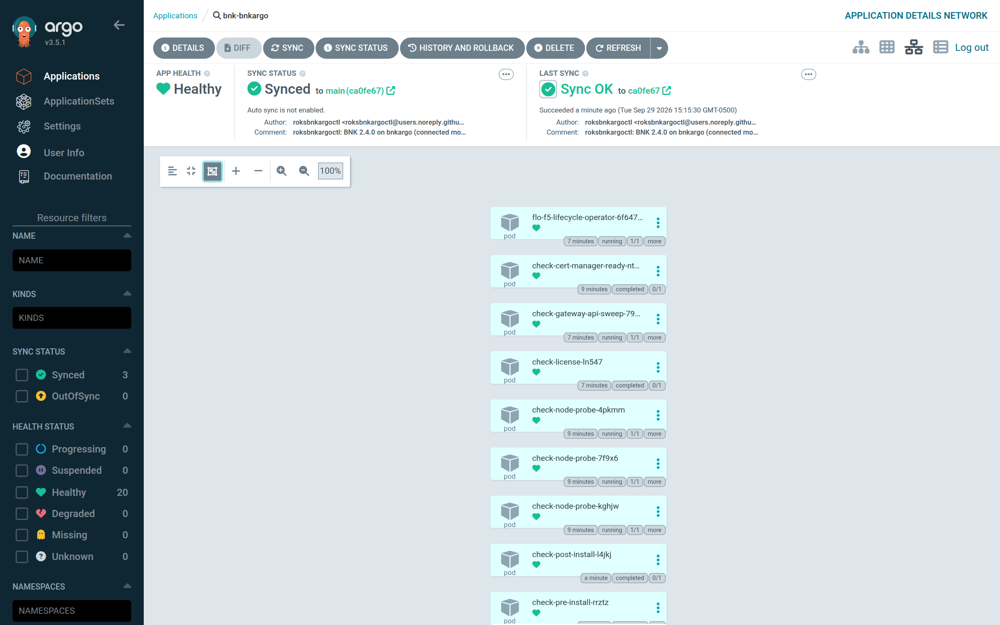

# The Argo CD Application: what is in Git, and what is not

This chapter describes the single Argo CD Application that roksbnkargoctl creates and every
object it syncs. After reading it you will be able to review `manifests/git/` before an
install, predict the order in which Argo CD applies and deletes BNK, and explain why some
objects are written straight into ROKS instead of going through Git.

## Git holds what the manual install writes

F5's manual procedure for BNK has the operator `helm install` two charts, cert-manager and
F5's lifecycle operator (FLO), each with a values file, and then apply a handful of YAML
files: the issuers, the network attachment, the `CNEManifest` and the `CNEInstance`. Your
repository holds the same things:

| In the manual procedure | In your repository, under `git.path` | Applied by |
|---|---|---|
| `helm install` of the cert-manager chart, with a values file | `values/cert-manager.yaml` | Argo CD, from the cert-manager chart in the registry |
| `helm install` of the `f5-lifecycle-operator` chart, with a values file | `values/flo.yaml` | Argo CD, from the FLO chart in the registry |
| The YAML files you apply | about 18 plain manifests: the issuers, the NAD, FLO's SCC binding, `CNEManifest` and `CNEInstance`, plus the namespaces and roksbnkargoctl's own `check` hooks, node probe and sweep | Argo CD, from Git |

The charts themselves are not copied into Git. The Application installs each one as a Helm
source, pulled from FAR or your mirror as `helm install` would pull it, with the values
file from your repository. So a reviewer sees two values files and the handful of custom
resources, not the roughly 80 objects the two charts expand to.

Argo CD's resource tree still lists every object of both charts, including their CRDs,
as it does for any Application with a Helm source. That is where the chart's objects are
visible; they are not in Git.

## Outputs of one render

`roksbnkargoctl render` (and step 4 of [install](./08-install.md)) writes everything the
install consists of into the workspace:

| Output | Path in the workspace | Who applies it |
|---|---|---|
| Git objects | `manifests/git/NNN-<kind>-<ns>-<name>.yaml` | Argo CD, after `install` publishes the directory to your repo |
| Chart values | `manifests/git/values/cert-manager.yaml`, `manifests/git/values/flo.yaml` | Published with the Git objects; Argo CD reads them for the Helm sources, and does not apply them as manifests |
| Direct objects | `manifests/direct/NNN-<kind>-<ns>-<name>.yaml` | `install`, by server-side apply into ROKS (field manager `roksbnkargoctl`) |
| The charts as Argo CD renders them | `manifests/charts/<chart>/NNN-<kind>-<ns>-<name>.yaml` | Nobody: not published. For review, and for the [`--no-publish`](#without-letting-roksbnkargoctl-push-to-git) comparison |
| The Application | `manifests/application.yaml` | `install`, through the Argo CD API |

With the defaults the Git objects number 18 (20 with a private-CA mirror, 17 when
`bnk.cert_manager.install` is false, which also drops `values/cert-manager.yaml`). Each
values file starts with a comment naming the chart, its version, the release and the
namespace. `manifests/charts/` holds each chart templated the way Argo CD templates it
(the same release, namespace, values, Kubernetes version and API versions); its Secrets
have every value replaced by `++++++++`, as Argo CD's manifests API returns them.

The `manifests/` directory is replaced wholesale on every render, so an object that is no
longer rendered does not linger. Files are numbered in sync order (wave, then a kind order
that puts namespaces, CRDs, ServiceAccounts, Secrets and ConfigMaps first, then namespace
and name), which makes the render deterministic: an unchanged configuration produces
byte-identical files and publishing it commits nothing.

`render` changes nothing in the cluster, Argo CD or Git. Review `manifests/git/` before
your first install: it is the whole of what your repository will contain. It prints one
line per chart:

```text
✓ rendered 18 Git objects, 2 chart values files and … direct objects into …/manifests
  Helm source: cert-manager v1.17.3 from quay.io/jetstack/charts, release cert-manager in cert-manager (… objects), values in values/cert-manager.yaml
  Helm source: f5-lifecycle-operator … from repo.f5.com/charts, release flo in f5-bnk (… objects), values in values/flo.yaml
```

## The Application

`install` creates or updates the Application with
`POST /api/v1/applications?upsert=true&validate=true`. Its shape:

```yaml
apiVersion: argoproj.io/v1alpha1
kind: Application
metadata:
  name: bnk-<workspace>              # argocd.application
  namespace: argocd
  finalizers:
    - resources-finalizer.argocd.argoproj.io
  labels:
    app.kubernetes.io/managed-by: roksbnkargoctl
    roksbnkargoctl.io/workspace: <workspace>
spec:
  project: default                   # argocd.project
  sources:
    - repoURL: quay.io/jetstack/charts         # the mirror's copy in mirror mode
      chart: cert-manager
      targetRevision: v1.17.3                  # bnk.cert_manager.version
      helm:
        releaseName: cert-manager
        namespace: cert-manager
        valueFiles:
          - $values/bnk/<workspace>/values/cert-manager.yaml
        apiVersions: [config.openshift.io/v1, security.openshift.io/v1, route.openshift.io/v1, k8s.cni.cncf.io/v1]
        kubeVersion: <the cluster's>
    - repoURL: repo.f5.com/charts              # <mirror>/charts in mirror mode
      chart: f5-lifecycle-operator
      targetRevision: <the version the BNK manifest lists>
      helm:
        releaseName: flo
        namespace: f5-bnk                      # bnk.namespace
        valueFiles:
          - $values/bnk/<workspace>/values/flo.yaml
        apiVersions: [config.openshift.io/v1, security.openshift.io/v1, route.openshift.io/v1, k8s.cni.cncf.io/v1]
        kubeVersion: <the cluster's>
    - repoURL: <git.url>
      targetRevision: main                     # git.branch
      path: bnk/<workspace>                    # git.path
      ref: values
      directory:
        recurse: false
  destination:
    server: <ROKS API endpoint>      # resolved.argocd_cluster_server
    namespace: f5-bnk                # bnk.namespace
  syncPolicy:
    syncOptions:
      - ServerSideApply=true
      - RespectIgnoreDifferences=true
      - PruneLast=true
    retry:
      limit: 0
```

| Field | Value and reason |
|---|---|
| `metadata.name` | `argocd.application`, default `bnk-<workspace>` |
| `spec.project` | `argocd.project`, default `default` |
| `spec.sources` (charts) | One OCI Helm source per chart: cert-manager (only when `bnk.cert_manager.install` is true) and FLO. `repoURL` is the registry path without a scheme, which is Argo CD's form for an OCI Helm repository. Each sets the release name and namespace, reads its values file from the Git source (`$values/<git.path>/values/<chart>.yaml`), and passes the same Kubernetes version and OpenShift API versions `render` uses, so Argo CD templates the chart exactly as `manifests/charts/` shows it. The hub pulls these charts: see [the registries in Argo CD](#the-chart-registries-in-argo-cd) |
| `spec.sources` (Git) | Your repository, `git.branch` (default `main`), `git.path` (default `bnk/<workspace>`), a plain directory source with `recurse: false`, so `values/` is not applied as manifests. `ref: values` is the name the chart sources use to read their values files from it. No Kustomize or plugin source |
| `spec.destination.server` | The ROKS API endpoint chosen by `argocd.cluster_endpoint`: the cluster's **private** service endpoint (default, reached over the transit gateway) or its public one |
| `spec.destination.namespace` | `bnk.namespace` (default `f5-bnk`). Argo CD puts a namespaced object that names no namespace here, whatever a Helm source's namespace says. FLO's release namespace is this one; for cert-manager, released in `cert-manager`, `render` checks that every namespaced object names its namespace and fails otherwise, so nothing of cert-manager lands here by accident |
| `ServerSideApply=true` | FLO's CRDs, applied from its chart, exceed the size limit of client-side apply's last-applied annotation |
| `RespectIgnoreDifferences=true` | Honors any `ignoreDifferences` you add to the Application |
| `PruneLast=true` | Pruning happens after the rest of a sync |
| No `automated` block | Sync is manual. The sync is the operator's approval: `install` triggers it, or you trigger it from the Argo CD UI after `install --no-sync` |
| `retry.limit: 0` | A failed sync is not retried by Argo CD. Fix the cause and re-run `install` |
| Finalizer `resources-finalizer.argocd.argoproj.io` | Deleting the Application cascades. Without it Argo CD would delete the Application, orphan BNK, and skip the uninstall checks |



*The Application in Argo CD's Applications list: one Application per cluster, in project `default`.*



*The resource tree after a successful sync: Healthy and Synced, with every resource Synced and none OutOfSync. Pods that share a parent are drawn as one group node (here `Healthy 3 pods` under the node-probe DaemonSet); Argo CD switches to this view above 15 pods.*

The tree shows the objects of all three sources together: the charts' Deployments, RBAC
and CRDs sit beside the Git objects.

### The chart registries in Argo CD

Argo CD's repository server pulls the two charts, so `install` registers each chart
registry in Argo CD (`POST /api/v1/repositories?upsert=true`) as an OCI Helm repository:
type `helm`, `enableOCI: true`, named after the chart, in `argocd.project`.

| Chart | Registry entry (FAR) | Registry entry (mirror) | Login stored in Argo CD |
|---|---|---|---|
| cert-manager | `quay.io/jetstack/charts` | `<mirror host>/<prefix>/jetstack/charts` | none on `quay.io`; the mirror login in mirror mode |
| FLO | `<registry.far_host>/charts` | `<mirror host>/<prefix>/charts` | FAR's service account (`_json_key_base64` and the key from the FAR auth tarball), or the mirror login |

The registry login is attached only to an entry on the registry it belongs to: the FAR key
goes to FAR, never to `quay.io`, and an anonymous mirror (no `registry.mirror.username`)
gets no login. `install` prints one line per entry:

```text
✓ Argo CD pulls the cert-manager chart from quay.io/jetstack/charts
✓ Argo CD pulls the f5-lifecycle-operator chart from repo.f5.com/charts
```

With a private-CA mirror (`registry.mirror.ca_file`), `install` also adds the CA to Argo CD
as a TLS certificate for the mirror's host name (`POST /api/v1/certificates?upsert=true`,
the shape `argocd cert add-tls` sends), so the repository server verifies the mirror
rather than skipping verification: `✓ Argo CD trusts the mirror's CA for <host>`.

> **Security note: the registry credential is stored in Argo CD.** In FAR mode the FAR
> service-account key, and in mirror mode the mirror user and password, are kept by
> Argo CD on the hub as a repository credential. Anyone who can read Argo CD's repository
> credentials or the Secrets in its namespace can read them. Use a mirror account that
> can only pull, and protect the hub as you protect the FAR key itself.
> `uninstall --remove-repo` deletes the entries; see
> [Appendix D](./appendix-d-security.md#the-registry-credential-is-stored-in-argo-cd).

### How the destination cluster is registered

Argo CD reaches ROKS with a ServiceAccount token that `install` mints on the cluster:

| Object (on ROKS) | Name |
|---|---|
| ServiceAccount | `kube-system/roksbnkargoctl-argocd-manager` |
| ClusterRoleBinding to `cluster-admin` | `roksbnkargoctl-argocd-manager` |
| Long-lived token Secret (`kubernetes.io/service-account-token`) | `kube-system/roksbnkargoctl-argocd-manager-token` |

The binding is `cluster-admin` because the Application installs CRDs, cluster roles and
SCC bindings. `install` then registers the cluster with `POST /api/v1/clusters?upsert=true`:
name = the ROKS cluster name, server = the chosen endpoint, bearer token = the token above,
label `app.kubernetes.io/managed-by: roksbnkargoctl`.

The CA sent with the registration depends on the endpoint. The ROKS private endpoint's
certificate chains to the cluster's own root CA (the `ca.crt` of the token Secret), so that
CA is sent. The public endpoint presents a publicly trusted certificate, so no CA is sent: a
cluster CA would replace Argo CD's system roots and the connection would fail with
`x509: certificate signed by unknown authority`.

## Sync waves and every object

Every Git object carries `argocd.argoproj.io/sync-wave`. The charts' objects carry none,
so they sync in wave 0: what must come before them has a negative wave, what needs them a
positive one. Argo CD applies waves in ascending order and does not start a wave until the
previous one is healthy and its hooks have finished. Names below use the default
namespaces (`bnk.namespace: f5-bnk`, `bnk.utils_namespace: f5-utils`).

| Wave | Kind | Name | Notes |
|---|---|---|---|
| −20 | Namespace | `f5-bnk`, `f5-utils`, `cert-manager` | `cert-manager` only when `bnk.cert_manager.install` is true (the default). All carry `Delete=false` |
| −19 | ConfigMap | `roksbnkargoctl-check/registry-ca` | Only when `registry.mirror.host` and `registry.mirror.ca_file` are set |
| −19 | DaemonSet | `roksbnkargoctl-check/registry-ca-trust` | Same condition. Installs the mirror CA on every node; see [registry](./13-registry.md) |
| −18 | DaemonSet | `roksbnkargoctl-check/check-node-probe` | `check node-probe` on every node, host network |
| −18 | Job (Sync hook) | `roksbnkargoctl-check/check-pre-install` | Cluster prerequisites and the node-probe verdicts |
| −6 | NetworkAttachmentDefinition | `f5-bnk/ens3-ipvlan-l2` | ipvlan L2 on `ens3`, static address `bnk.nad_address` (default `10.10.1.1/24`) |
| −6 | ClusterRoleBinding | `system:openshift:scc:privileged:f5-bnk:flo-f5-lifecycle-operator` | Grants FLO's ServiceAccount the `privileged` SCC |
| −6 | Deployment | `roksbnkargoctl-check/check-gateway-api-sweep` | Removes OpenShift's Gateway API CRD admission policy until the F5 Gateway API CRDs exist |
| 0 | cert-manager chart (Helm source) | every object of the Jetstack chart `v1.17.3`, including its CRDs | Only when cert-manager is installed by roksbnkargoctl. `startupapicheck` is disabled |
| 0 | FLO chart (Helm source) | every object of `f5-lifecycle-operator` (release `flo`, namespace `f5-bnk`), including its `k8s.f5.com` CRDs | The chart version is the one the BNK 2.4.0 manifest lists (`v2.30.0-0.5.2`) |
| 1 | Job (Sync hook) | `roksbnkargoctl-check/check-cert-manager-ready` | Waits until cert-manager's webhook admits a dry-run `ClusterIssuer` |
| 2 | ClusterIssuer | `selfsigned-cluster-issuer` | |
| 3 | Certificate | `cert-manager/ext-ca` | Self-signed CA, ECDSA P-256 |
| 4 | ClusterIssuer | `sample-issuer` | CA issuer backed by `ext-ca`; the issuer FLO and the CNEInstance use |
| 6 | CNEManifest | `bnk-2.4.0` | Cluster-scoped. `SkipDryRunOnMissingResource=true` (its CRD arrives with the FLO chart in wave 0 of the same sync) |
| 8 | CNEInstance | `<bnk.namespace>/<bnk.namespace>-f5-cne-controller` (`f5-bnk/f5-bnk-f5-cne-controller` by default) | `deploymentSize: Tiny`, `tmmReplicas` from `bnk.tmm_replicas`. `SkipDryRunOnMissingResource=true` |
| 10 | Job (Sync hook) | `roksbnkargoctl-check/check-license` | Builds the `License`, waits for `Active`, then for `CNEInstance` `Available` |
| PostSync | Job (hook) | `roksbnkargoctl-check/check-post-install` | Verifies the finished install |
| PreDelete | Job (hook) | `roksbnkargoctl-check/check-pre-uninstall` | Drains F5 resources while FLO still runs; CNEInstance last |
| PostDelete | Job (hook) | `roksbnkargoctl-check/check-post-uninstall` | License secrets, namespaces, stuck F5 finalizers |

A render prints the Git objects as a per-wave summary (the charts are the `Helm source:`
lines above it, and have no row here), for example:

```text
   -20  Namespace×3
   -18  DaemonSet, hook:check-pre-install
   ...
    10  hook:check-license
 hooks  PostSync:check-post-install, PreDelete:check-pre-uninstall, PostDelete:check-post-uninstall
```



*The last sync's result, one row per object with its sync wave, hook and message. The check hooks show as Jobs with their hook type (here the `Sync` hook `check-pre-install`).*



*The list view: every object the Application manages, with its sync and health status.*

### Why the Gateway API sweep is a Deployment

The sweep waits for CRDs that FLO installs in a *later* wave (0). Argo CD will not start
wave 0 until wave −6's hooks finish, so a blocking hook would deadlock. A Deployment is
healthy as soon as its pod runs, which lets the sync continue while the sweep keeps
working.

### The hooks

Every check runs from the same `check` image. Each hook Job has `backoffLimit: 0`, an
`activeDeadlineSeconds` a little longer than its own `--timeout`, and
`argocd.argoproj.io/hook-delete-policy: BeforeHookCreation`: a failed Job and its logs stay
until the next sync creates the hook again, which is when you need them.

| Job | Argo CD hook | Wave | `--timeout` | Job deadline |
|---|---|---|---|---|
| `check-pre-install` | Sync | −18 | 15m | 20m |
| `check-cert-manager-ready` | Sync | 1 | 10m | 12m |
| `check-license` | Sync | 10 | 10m License CRD, 5m apply retry, 35m License `Active`, 15m `CNEInstance` `Available` (all rendered) | 70m (the waits plus 5m) |
| `check-post-install` | PostSync | — | 10m | 15m |
| `check-pre-uninstall` | PreDelete | — | 15m | 20m |
| `check-post-uninstall` | PostDelete | — | 15m | 20m |

PreDelete hooks exist only in Argo CD 3.3 and later, which is why `install` refuses an older
Argo CD. `uninstall` does not rely on the two delete hooks alone: it runs the same checks as
its own Jobs, before and after the delete (see [uninstall](./10-uninstall.md#the-sequence)). What each check verifies is in the [checks reference](./16-checks.md).

Charts' own Helm hooks keep their `helm.sh/hook` annotations; Argo CD maps them to its own
hook phases. They carry no wave from roksbnkargoctl, so they run in wave 0 unless the chart
sets one.

### The check image is pinned by digest

Every check pod references the image as `repo@sha256:…`, resolved at render time. With a
mutable tag and `imagePullPolicy: IfNotPresent`, nodes keep running whatever they cached,
so a re-sync after a check fix would run the old check. A new image digest also changes
the render, which rolls the node probes. See [install](./08-install.md#the-check-image).

## What is not in Git, and why

These objects are written straight into ROKS by `install` and never reach your
repository.

| Object | Where | Why it is not in Git |
|---|---|---|
| Pull secret `far-secret` (FAR) or `mirror-secret` (mirror), type `kubernetes.io/dockerconfigjson` | `f5-bnk`, `f5-utils`; in mirror mode also `roksbnkargoctl-check` and (when installed by roksbnkargoctl) `cert-manager` | A registry credential. Not created in mirror mode when `registry.mirror.username` is empty |
| Secret `bnk-license-jwt` (key `jwt`) | `roksbnkargoctl-check` | The subscription JWT |
| Secret `licenseserver-rootca` (key `licenseserver-rootca.txt`) | `f5-utils` | The FLP root CA; disconnected mode only |
| Namespace `roksbnkargoctl-check`, ServiceAccount `check`, ClusterRole and ClusterRoleBinding `roksbnkargoctl-check`, ClusterRoleBinding `system:openshift:scc:privileged:roksbnkargoctl-check:check` | cluster / `roksbnkargoctl-check` | Must outlive the Application: the PostDelete hook runs after Argo CD has deleted everything it owns |
| Namespaces `f5-bnk`, `f5-utils`, `cert-manager` (again) | cluster | Created before the Secrets that live in them. Argo CD adopts them when it syncs wave −20 |

A Secret that a chart ships, such as FLO's `external-otelsvr-secret`, is chart content:
Argo CD applies it from the chart like the chart's other objects. It is neither in Git nor
written by `install`, and it carries no value of yours.

Before publishing, the renderer scans every Git object and both values files for the
registry password and the subscription JWT and refuses to publish if either appears:

```text
render: refusing to publish: the subscription JWT appears in <Kind> <ns>/<name>
render: refusing to publish: the registry password appears in values/<chart>.yaml
```



*The CNEInstance `f5-bnk-f5-cne-controller` as Argo CD shows it: the live manifest carries FLO's finalizer and the sync wave, and the spec is the Tiny, IBM-specific one the renderer writes.*

### The License is built by a hook

In BNK 2.4 `License.spec.jwt` is required and inline; the CRD has no Secret reference. A
`License` in Git would therefore put the JWT in Git. Instead the `check license` hook (wave
10) reads Secret `roksbnkargoctl-check/bnk-license-jwt` and server-side-applies
`License f5-utils/bnk-license` itself:

| `License.spec` field | connected | disconnected |
|---|---|---|
| `jwt` | from the Secret | from the Secret |
| `operationMode` | `connected` | `f5licenseproxy` |
| `teemCertUrl`, `teemEntitlementUrl`, `teemInitialConfigUrl` | not set | `https://<flp-ip>:8443/license-proxy/v1` |
| `licenseProxyServerRootCaPath` | not set | `/etc/cm20/licenseserver-rootca/licenseserver-rootca.txt` |

Building it in a hook also solves an ordering problem: the `License` CRD is installed at
runtime by FLO, not by its chart, so a `License` in Git could not pass Argo CD's dry run.

### The check namespace and RBAC must outlive the Application

The PostDelete hook `check-post-uninstall` runs after Argo CD has pruned every object it
owns. If its namespace, ServiceAccount or RBAC were in Git they would already be gone. They
are created by `install` and removed by `uninstall` only after the Application has been
deleted. The `check` ClusterRole reads core, apps, batch and storage resources, can patch
Deployments, DaemonSets and StatefulSets (to roll CWC), can patch and delete pods, Secrets,
namespaces and a few other core resources, can delete
validating admission policies and webhooks, can create (dry-run) ClusterIssuers, and has
full access to the F5 API groups (`k8s.f5.com`, `k8s.f5net.com`, `gateway.k8s.f5.com`,
`fic.f5.com`, `metrics.f5.com`) because the uninstall checks delete whatever F5 resources
exist. The privileged SCC binding is for the node probe's host network and the CA
installer's `hostPath`.

## What Argo CD must not delete

The BNK namespaces carry `argocd.argoproj.io/sync-options: Delete=false`, so Argo CD leaves
them in place when the Application is deleted. The charts' CRDs are kept another way:

| Objects | How they are kept | Why |
|---|---|---|
| Namespaces `f5-bnk`, `f5-utils`, `cert-manager` | `Delete=false` on the Namespace in Git | A namespace stuck on an F5 finalizer would hang the Application's deletion before the PostDelete check ever ran. `check post-uninstall` deletes them itself and strips F5 finalizers if they stick |
| The CRDs of both charts (FLO's `k8s.f5.com` CRDs, and cert-manager's) | Both charts are rendered with `crds.keep: true`, which annotates their CRDs `helm.sh/resource-policy: keep`. Argo CD honours that annotation when it deletes the Application | Deleting a CRD deletes every CR of that kind; F5 CRs whose controller is already gone hang their namespace |

The CRDs are not in Git, so there is nothing to mark `Delete=false` on them. On Argo CD
3.5.1, after a cascading delete of an Application with the FLO chart as a Helm source, all
26 of the chart's CRDs remained while the chart's ClusterRole was removed. CRDs FLO's
crd-installer creates at runtime (the `License` CRD and the Gateway API CRDs) were never
Argo CD's to delete.

## How the Helm charts are installed

Argo CD pulls each chart from its registry and templates it with the values file from Git,
as `helm install` would; the objects are then synced like any other. `render` does the same
templating on your host, only to show you the result (`manifests/charts/`) and to let
`install --no-publish` compare it with Argo CD's. No `helm` binary is used.

| Chart | Pulled from | Release / namespace |
|---|---|---|
| cert-manager `v1.17.3` (`bnk.cert_manager.version`) | `oci://quay.io/jetstack/charts/cert-manager`, or the mirror's copy | `cert-manager` / `cert-manager` |
| `f5-lifecycle-operator` (the version the BNK manifest lists) | `oci://<FAR or mirror>/charts/f5-lifecycle-operator` | `flo` / `bnk.namespace` |

`render` pulls the chart archives over OCI in-process and templates them with the Helm Go
SDK in client-only dry-run mode: CRDs included, OpenAPI validation off, the cluster's
Kubernetes version (read from ROKS; `v1.34.0` with `render --no-cluster`), and the API
versions `config.openshift.io/v1`, `security.openshift.io/v1`, `route.openshift.io/v1` and
`k8s.cni.cncf.io/v1` so that charts detect OpenShift (FLO grants SCC access only when
`config.openshift.io/v1` exists). The Application's Helm sources pass Argo CD the same
Kubernetes version and API versions, so both template the same objects.

Helm's `lookup` returns nothing when templating without a cluster, on your host and in
Argo CD alike. FLO's chart looks up cert-manager's CRDs and fails when it cannot see them,
so its values set `skipCertMgr: true`. That skips only the chart's pre-check;
cert-manager is still installed, and the issuers wait for `check cert-manager-ready`.

Values that matter:

| Chart | Values set (in `values/<chart>.yaml`) |
|---|---|
| cert-manager | `crds.enabled: true`, `crds.keep: true`, `startupapicheck.enabled: false`; in mirror mode every component image (`controller`, `webhook`, `cainjector`, `acmesolver`) is redirected to `<mirror>/jetstack/cert-manager-<component>` and the pull secret is added |
| FLO | `skipCertMgr: true`, `crds.enabled: true`, `crds.keep: true`, `containerPlatform: IBM`, `namespace` and `sharedComponentNamespace` from the BNK namespaces, `global.certmgr.clusterIssuer: sample-issuer`, image repository `<FAR or mirror>/images` with `pullPolicy: Always`, the pull secret when there is one |

The values files name the pull secret, never its contents.

## The redacted copy under `manifests/direct`

`manifests/direct/` holds every direct object as `install` applies it, except that Secret
values are replaced (`data` values by the base64 of `REDACTED`, `stringData` values by
`REDACTED`) and each Secret gains the annotation `roksbnkargoctl.io/redacted`. The real
Secrets exist only in ROKS. `uninstall` reads this directory to know what to delete, which
needs only kind, namespace and name; keep it in the workspace until you have uninstalled.



*The network view: the Application's pods, among them FLO and the check pods. The Sync hooks' pods show `completed`, the node probes and the Gateway API sweep `running`.*

## Without letting roksbnkargoctl push to Git

Some teams do not let tools push to the repository Argo CD syncs from: every change goes
through their own review. For them, `export` packs the Git content into a zip you commit
yourself, and `install --no-publish` does the rest of the install without touching Git.

```sh
roksbnkargoctl render                    # writes manifests/git/
roksbnkargoctl export                    # roksbnkargoctl-<workspace>.zip
# unzip at the root of your repository, review, commit, push to git.branch
roksbnkargoctl install --no-publish
```

`export` zips the workspace's `manifests/git/`, values files included (so run `render`
first). The paths in the zip start at `git.path`, so unzipping it at the root of your
repository puts every file where the Application reads them:

```text
bnk/demo/NNN-<kind>-<ns>-<name>.yaml       every manifest of manifests/git, under git.path
bnk/demo/values/cert-manager.yaml          the charts' Helm values
bnk/demo/values/flo.yaml
ROKSBNKARGOCTL-EXPORT.md                   what to do with the zip, for this workspace
roksbnkargoctl-application.yaml            the Application install creates, for reference
```

It prints `✓ exported <n> files under <git.path>/ to <zip>`, counting the manifests and
the values files. `manifests/charts/` is not exported: Argo CD pulls the charts from the
registry.

| Property | Detail |
|---|---|
| Output | `-o`, `--output <file>`; default `roksbnkargoctl-<workspace>.zip` in the current directory, mode 0600 |
| No Secret, ever | The Git content never holds one (see [above](#what-is-not-in-git-and-why)), and `export` checks again: a file of `kind: Secret` stops it with `<file> is a Secret; refusing to export it for Git` |
| Deterministic | Files are in sorted order and every entry carries the same fixed timestamp, so an unchanged render exports a byte-identical zip |
| Stale render | If `config.yaml` changed after the last `render`, `export` warns: `config.yaml changed after the last render; run `roksbnkargoctl render` to export the current configuration` |
| Nothing rendered | `nothing rendered in <workspace>/manifests/git: run `roksbnkargoctl render` first` |

`ROKSBNKARGOCTL-EXPORT.md` repeats the steps with your repository, branch and path filled
in. When you unzip, **replace** the directory's previous contents: a file left over from
an earlier export would be synced too. `roksbnkargoctl-application.yaml` is for review
only; do not apply it by hand, because `install` also registers the cluster and writes
the Secrets the Application depends on.

`install --no-publish` does everything `install` does except push to Git: the transit
gateway attachment, the IAM trusted profile, the render, the Secrets and other objects
written straight into ROKS, the cluster registration in Argo CD, the Application and the
sync. **Push the export before you run it.** Before it syncs, `install` asks Argo CD
which commit `git.branch` resolves to, and for what the Application would sync at that
commit: the Git objects and both charts templated with the values files at that commit. It
compares that, object by object, with this workspace's `manifests/git/` and
`manifests/charts/`. If the repository holds an older export, a partial one, or nothing,
it lists the differences and does not sync; otherwise it syncs exactly the commit it
compared. See
[install](./08-install.md#without-letting-roksbnkargoctl-push-to-git).

## See also

- [How an install flows](./02-how-an-install-flows.md)
- [install](./08-install.md) and [uninstall](./10-uninstall.md)
- [Checks reference](./16-checks.md)
- [Appendix D. Security model](./appendix-d-security.md)
