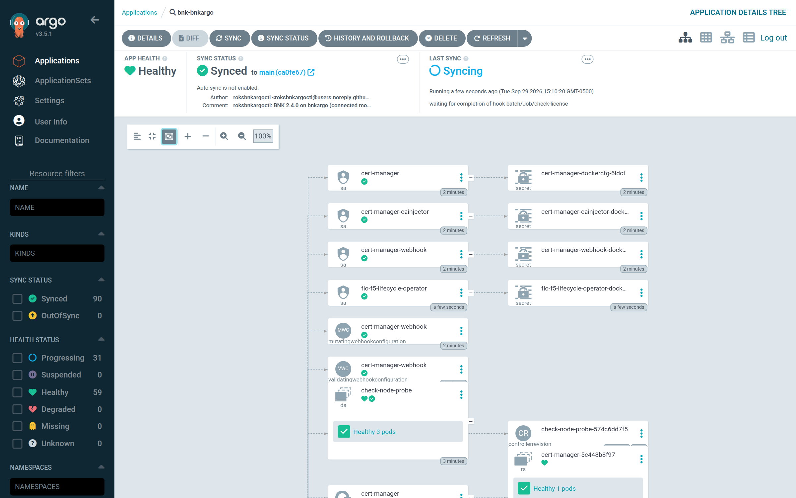
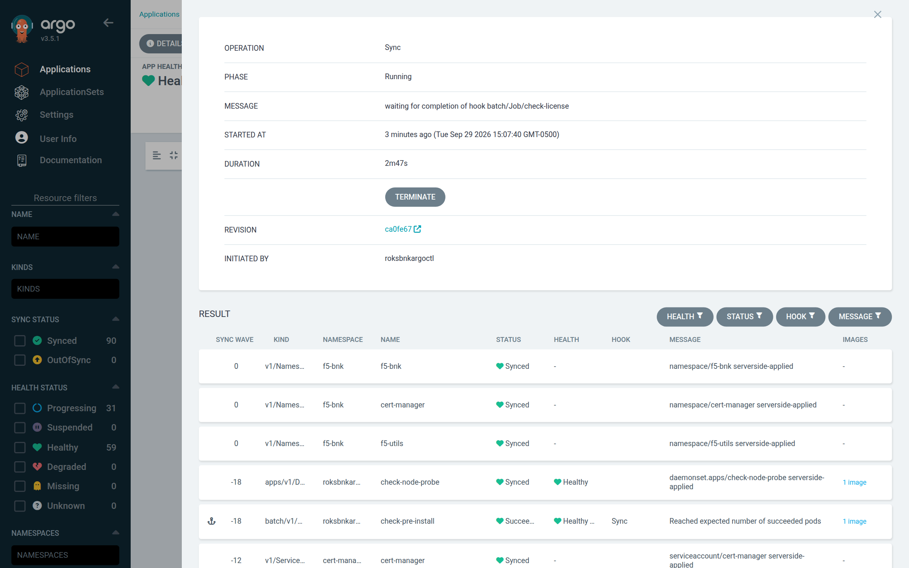
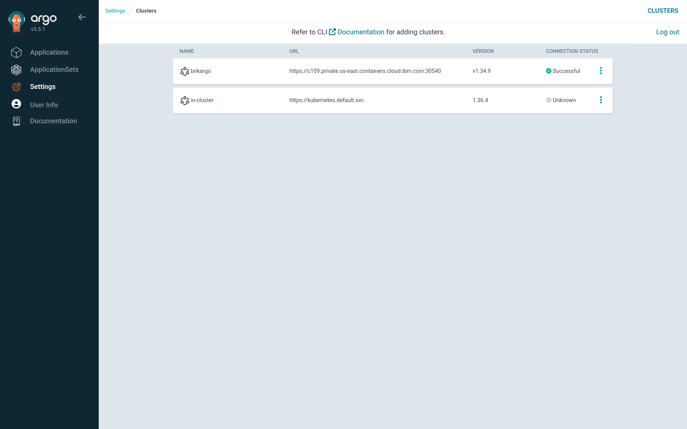
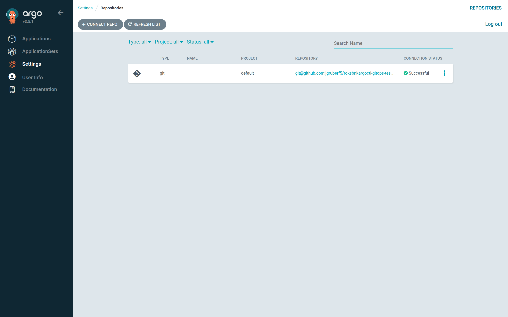

# install

This chapter walks through `roksbnkargoctl install` step by step: what each step does, what
can make it fail, and why re-running it is safe. After reading it you will be able to run an
install, read its progress, and recover from a stopped install by fixing the cause and
running the same command again.

## Usage

```sh
roksbnkargoctl install [--no-sync] [--no-publish] [--timeout 1h15m0s] [-w <workspace>]
```

| Flag | Default | Meaning |
|---|---|---|
| `--no-sync` | `false` | Create the Application but do not sync it. Sync it from the Argo CD UI, or run `install` again without the flag |
| `--no-publish` | `false` | Do everything except push to Git (step 7). The Application syncs what you pushed yourself; see [below](#without-letting-roksbnkargoctl-push-to-git) |
| `--timeout` | `1h15m0s` | How long to wait for the sync to finish |
| `-w`, `--workspace` | the current workspace | Which workspace to install |

`install` needs these environment variables (the names are configurable):

| Variable | Config key that names it | Used for |
|---|---|---|
| `IBMCLOUD_API_KEY` (or `IC_API_KEY`) | `ibmcloud.api_key_env` | IBM Cloud: transit gateway, IAM, cluster kubeconfig, COS |
| `ARGOCD_AUTH_TOKEN` | `argocd.token_env` | The Argo CD API |
| `ROKSBNKARGOCTL_GIT_TOKEN` | `git.token_env` | HTTPS Git: the access check in step 1 and the push (not needed with `git.ssh_key_file`; optional with `--no-publish`) |
| `ROKSBNKARGOCTL_MIRROR_PASSWORD` | `registry.mirror.password_env` | Mirror pull secret, when `registry.mirror.username` is set |

## Idempotent by design

`install` is idempotent. Every step finds what already exists before creating anything, the
render is deterministic, and Git and Argo CD are updated with upserts. When a step fails,
fix the cause and run `install` again; completed steps are recognized and skipped or
converged, not duplicated.

## The steps, in order

Before step 1, `install` validates `config.yaml` (every invalid key is listed at once),
checks that the workspace was resolved by `init`, and loads the Git credential and any
`git.known_hosts_file`. A missing Git credential stops it here, except with
`--no-publish`.

| # | Step | What can fail | On re-run |
|---|---|---|---|
| 1 | Argo CD version and token, then Git access | Token missing or not accepted; server older than 3.3; the Git credential cannot push (with `--no-publish`: the repository cannot be read, or has no `git.branch`) | Re-checked |
| 2 | Transit gateway attachment | Prefix overlap with a VPC already on the gateway; attach timeout (10 min) | Found attached, skipped |
| 3 | IAM trusted profile | IAM permissions | Found by name; missing link or policies added |
| 4 | Render | FAR or mirror unreachable or unauthorized; JWT or FAR key not found; check image missing from the mirror; a secret value in a Git object or a values file | Re-rendered; identical output for unchanged inputs |
| 5 | Out-of-band objects into ROKS | Cluster API unreachable; RBAC | Server-side apply converges |
| 6 | Register ROKS with Argo CD | Token Secret not populated in 2 min; Argo CD API errors | Apply and upsert converge |
| 7 | Publish to Git | Credentials, host key, branch protection | No commit when nothing changed |
| 8 | Repositories, Application, sync | Argo CD API errors; Argo CD cannot pull a chart; a check fails; timeout | Upsert, then a new sync |

### 1. Argo CD 3.3 or later, and a token it accepts

`install` calls `GET /api/version` and requires version 3.3.0 or later, because the
uninstall checks are PreDelete hooks, which Argo CD added in 3.3. `/api/version` answers
without authentication, so `install` then calls `GET /api/v1/session/userinfo` with the
token from `ARGOCD_AUTH_TOKEN` and requires `loggedIn`. It needs no RBAC permission and
accepts local-account, project-role and SSO tokens alike. Either failure stops the install
before anything changes:

```text
argocd: server version v3.2.4 is older than the required 3.3.0 (PreDelete hooks need Argo CD >= 3.3)
argocd: the server at https://… did not accept the API token (session/userinfo: not logged in); check ARGOCD_AUTH_TOKEN
```

On success it prints the version and server, for example `Argo CD v3.5.1+… at https://…`.
If the Argo CD server uses a private CA, set `argocd.ca_file`; `argocd.insecure: true`
skips verification (the test hub uses it).

#### Git access, before anything changes

Still in step 1, before the transit gateway, IAM, ROKS or Argo CD are touched, `install`
proves it can use the Git repository with the credential it has (the same authentication
and SSH host-key verification as the push in step 7):

| Run | What must hold | On success |
|---|---|---|
| `install` | The credential may **push** to `git.url`. `install` asks for the ref list a push starts with (the `git-receive-pack` advertisement), which Git hosts serve only to a credential allowed to push. Nothing is pushed | `✓ Git <url>: the credential can push`, or `✓ Git <url> is empty; the first push creates <branch>` |
| `install --no-publish` | The repository can be **read** (the clone advertisement), and `git.branch` exists in it, since the Application syncs what is already there | `✓ Git <url>: readable, branch <branch> present` |
| `install --no-publish`, no Git credential set | **Argo CD** can read the repository, with the credential registered in it or anonymously, and lists `git.branch` among its branches (`GET /api/v1/repositories/{repo}/refs`, tried with `argocd.project` first) | `✓ Git <url>: Argo CD reads it, branch <branch> present` |

A failure stops the install with nothing changed, for example:

```text
git: https://… not found, or the credential cannot see it: …
git: the credential may not push to https://… (a read-only token or deploy key?): …
git: https://… has no branch main: push the export there first (roksbnkargoctl export)
```

The [troubleshooting guide](./17-troubleshooting.md#before-the-sync-init-render-install)
lists every message. With `--no-publish` and no Git credential set, the check is made by
Argo CD, not from your machine: a private repository only needs to be registered in Argo
CD with its own credential, and you need none.

### 2. Transit gateway attachment

Argo CD reaches the ROKS private endpoint over the transit gateway, so the cluster VPC must
be attached to it.

- If a connection for the cluster VPC already exists, `install` waits (up to 10 minutes) for
  it to be `attached` and moves on.
- Otherwise it reads the cluster VPC's address prefixes and the prefixes of every VPC
  already on the gateway. If any overlap, it refuses: a transit gateway silently blackholes
  one of two overlapping VPCs.

  ```text
  refusing to attach: the cluster VPC overlaps VPCs already on <gateway>:
    10.243.0.0/18 overlaps 10.243.0.0/16 on VPC "<connection> (<region>)"
  ```

- With no overlap it creates a VPC connection named after the cluster and waits for it to
  attach. The connection id is recorded as `resolved.tgw_connection_created_id`, so
  `uninstall --detach-tgw` removes only a connection that `install` itself made.

The cluster and the transit gateway themselves are never created or deleted.

### 3. The IAM trusted profile

BNK's CNE controller programs VPC routes with an IAM trusted profile that it assumes from
its ServiceAccount. `install` ensures:

| Item | Value |
|---|---|
| Profile name | `<cluster-name>-f5-cne-controller-<bnk.namespace>` (the name roksbnkctl uses, so a cluster moved between the tools keeps one profile) |
| Link | ROKS ServiceAccount `<bnk.namespace>/f5-cne-controller` in this cluster (link name `f5-cne-controller-roks-link`) |
| Policy 1 | `Viewer` + `Editor` on service `is` (VPC Infrastructure), scoped to the cluster's VPC (`vpcId`) |
| Policy 2 | `Viewer` on service `containers-kubernetes`, scoped to the cluster (`serviceInstance`) |

The profile is looked up by name and created only if absent; the link is added only if no
existing link matches the namespace, ServiceAccount and cluster; the two policies are
created only if the profile has fewer than two. The profile id is saved in
`resolved.trusted_profile_id` and rendered into the CNEInstance as `CLOUD_TRUSTED_PROFILE`.
The ServiceAccount name matters: a wrong one fails silently (status stays green but the data
path never comes up).

### 4. Render

This is the same render as [`render`](./07-the-application.md), reading the cluster:

1. Fetch the BNK 2.4.0 manifest chart from FAR or the mirror, then the FLO chart it lists,
   then the cert-manager chart (unless `bnk.cert_manager.install: false`).
2. Read the Kubernetes version from ROKS, and the `openshift-dns/node-resolver` image when
   a mirror CA is configured.
3. Read the FLP URL and CA (disconnected mode) from `flp-outputs.json` or `flp.external`.
4. Read the FAR service-account key (FAR mode) and the subscription JWT, from COS or the
   local files named in `cos.local_far_auth_file` / `cos.local_jwt_file`.
5. Resolve the check image to a digest (below).
6. Build the Git and direct objects and the charts' values files, template both charts
   the way Argo CD will, and write `manifests/`.

It prints `rendered N Git objects, M Helm charts, K direct objects`.

#### Deterministic render

Every node-probe pod carries a run id, `roksbnkargoctl.io/run-id`. It is a hash of the
configuration (excluding the `resolved:` bookkeeping section), the manifest version, the
check image digest, the FLP URL, the mirror CA and the node-resolver image. The same inputs
produce the same run id and byte-identical manifests, so publishing an unchanged install
commits nothing. Any change to those inputs changes the run id, which rolls every probe pod
so that `check pre-install` never reads a verdict from an earlier sync.

#### The check image

The check image is `ghcr.io/jgruberf5/roksbnkargoctl-check`, tagged with the
roksbnkargoctl release version (`vX.Y.Z`); a non-release build uses `:dev`. `check.image`
overrides the source. The tag is resolved to a digest and rendered as `repo@sha256:…`.

In mirror mode the digest is resolved **upstream**, not from the mirror, and that exact
digest must already be in the mirror. A mirror does not follow a mutable tag, so resolving
the tag there could pin a stale copy and run a check that no longer matches the code. If
the mirror lacks it, the install stops:

```text
the mirror has an older copy (sha256:…) of the check image, not sha256:… (ghcr.io/jgruberf5/roksbnkargoctl-check:vX.Y.Z): run `roksbnkargoctl registry replicate` so the cluster runs the current check
```

If your host cannot reach `ghcr.io` at all, the mirror's own digest is used with a warning
that its currency could not be checked.

### 5. Out-of-band objects into ROKS

`install` fetches the cluster's admin kubeconfig through the IBM Cloud API (public endpoint;
set `ROKSBNKARGOCTL_PRIVATE_ENDPOINT=1` if your host can reach only the private endpoint)
and server-side-applies every object in `manifests/direct/` with force: namespaces first,
then the ServiceAccount, ClusterRole and ClusterRoleBindings, then the Secrets. See
[what is not in Git](./07-the-application.md#what-is-not-in-git-and-why) for the list.

### 6. Register ROKS with Argo CD

`install` applies ServiceAccount `kube-system/roksbnkargoctl-argocd-manager`, its
`cluster-admin` ClusterRoleBinding and a token Secret, waits up to 2 minutes for the token,
and upserts the cluster in Argo CD at `resolved.argocd_cluster_server` (the private endpoint
unless `argocd.cluster_endpoint: public`). The cluster CA is sent only for the private
endpoint. The Argo CD hub must be able to route to that endpoint, which is what step 2 is
for.

### 7. Publish to Git

`install` clones `git.branch` of `git.url` in memory (no `git` binary), replaces
`git.path` with the contents of `manifests/git/` exactly, and commits only if something
changed:

```text
roksbnkargoctl: BNK 2.4.0 on <cluster> (connected mode, far registry)
```

| Situation | Result |
|---|---|
| Nothing changed | `Git already up to date at <sha>`; no commit |
| Branch does not exist | Created from the repository's default branch |
| Empty repository | First commit on the branch |
| Someone pushed meanwhile (non-fast-forward) | Retried once from a fresh clone |

The commit author defaults to `roksbnkargoctl <roksbnkargoctl@users.noreply.github.com>`
(`git.author_name`, `git.author_email`). The resulting commit is saved as
`resolved.last_published_commit` and is the revision the sync uses.

SSH host keys are always verified. Keys for `github.com`, `gitlab.com` and `bitbucket.org`
are built in; for any other server set `git.known_hosts_file`, which `install` also adds to
Argo CD's known hosts so the hub verifies the same key. The environment variable
`ROKSBNKARGOCTL_GIT_INSECURE_HOSTKEY=1` switches verification off, with a warning; prefer
`git.known_hosts_file`.

### 8. Repository, Application and sync

1. Upsert the repository in Argo CD (`POST /api/v1/repositories`) with the Git URL and the
   token or SSH key, in `argocd.project`. With `--no-publish` and no Git credential set,
   this is skipped, so that an existing registration that carries a credential is not
   replaced by an anonymous one: `no Git credential set: leaving Argo CD's registration of
   <url> as it is (it reads the repository anonymously if none exists)`.
2. With a private-CA mirror, add the mirror's CA to Argo CD as a TLS certificate for its
   host: `✓ Argo CD trusts the mirror's CA for <host>`.
3. Upsert each chart registry as an OCI Helm repository, with the registry login (FAR's
   service account, or the mirror user and password) only on the registry that login is
   for: `✓ Argo CD pulls the <chart> chart from <registry>`. This stores the registry
   credential in Argo CD; see
   [the chart registries in Argo CD](./07-the-application.md#the-chart-registries-in-argo-cd).
4. Upsert the Application described in [chapter 7](./07-the-application.md).
5. With `--no-publish`, compare what is in Git with this render
   ([below](#without-letting-roksbnkargoctl-push-to-git)).
6. With `--no-sync`, stop here.
7. Otherwise start a sync with the Git source pinned to the published commit (with
   `--no-publish`, the commit just compared) and the charts at their versions, and wait up
   to `--timeout`, printing a line whenever the state changes:

   ```text
   [14:02:11] sync=OutOfSync health=Missing  Running waiting for completion of hook batch/Job/check-pre-install
   ```

The sync runs the waves in order: pre-install check, networking, the cert-manager and FLO
charts, the webhook gate, the issuers, the CNEManifest and CNEInstance, then the license
check, which
waits for the `License` to become `Active` and the CNEInstance `Available`, then the
post-install check. The pre-install check runs before any BNK object is applied, so a
failed prerequisite leaves the cluster untouched. A connected install on a verified cluster
spends roughly 8 to 10 minutes in the sync.

When the sync fails or times out, `install` says so and exits non-zero:

```text
sync did not succeed — `roksbnkargoctl status` shows the check results, `roksbnkargoctl diagnose` collects logs
```

Argo CD's health for F5 custom resources is not meaningful without custom Lua health
checks, which the hub's `argocd-cm` does not need. The real gate is the `check license`
hook, which fails the sync if BNK does not come up.



*Mid-sync: `Last sync` reads `Syncing`, waiting for completion of the `check-license` hook in the last wave. The earlier waves are Healthy while BNK's own resources are still Progressing.*



*The running operation: which wave Argo CD is on and which objects it is waiting for. `install` prints the same progress in the terminal.*



*Settings → Clusters after step 6: the ROKS cluster registered under its private endpoint.*



*Settings → Repositories after step 8: the Git repository `install` added, with its connection status. The screenshot predates the chart registries, which this page now also lists, as Helm repositories with OCI enabled.*

## Without letting roksbnkargoctl push to Git

If roksbnkargoctl must not push to your repository, publish the Git content yourself and
skip step 7:

1. `roksbnkargoctl render`, then `roksbnkargoctl export`, which writes
   `roksbnkargoctl-<workspace>.zip` with the files under `git.path`
   ([chapter 7](./07-the-application.md#without-letting-roksbnkargoctl-push-to-git)).
2. Unzip it at the root of your repository, replacing that directory's previous contents,
   then review, commit and push to `git.branch`, through whatever process your team uses.
3. `roksbnkargoctl install --no-publish`.

`install --no-publish` runs every step except the push to Git, and differs in three places:

- **Step 1** needs read access to the repository and `git.branch` present in it, not push
  rights ([above](#git-access-before-anything-changes)). A Git credential is optional.
- **Step 8** leaves Argo CD's Git repository registration alone when no Git credential is
  set. The chart registries are registered as usual.
- **Before the sync**, `install` checks that Git holds exactly this render. It refreshes
  the Application and reads the commit its Git source resolves to now
  (`status.sync.revisions`), then asks Argo CD for the manifests the Application would
  sync with the Git source pinned to that commit: the objects under `git.path`, and both
  charts templated with the values files at that commit. It compares them with
  `manifests/git/` and `manifests/charts/`, which step 4 has just rendered. Objects are
  matched by API group, kind, namespace and name, and compared by content, ignoring the
  tracking annotation and `app.kubernetes.io/instance` label Argo CD adds; Secret values
  compare as `++++++++`, as Argo CD returns them. A values file that differs shows up as
  differences in that chart's objects. Any difference stops the install before the sync,
  with up to ten differences listed:

  ```text
  the Application was created but NOT synced: what is in Git (revision 3f2a9c1d0e) does not match this workspace's render (2 difference(s)):
    different in Git: apps/Deployment f5-utils/…
    missing in Git: /ConfigMap f5-bnk/…
  run `roksbnkargoctl export`, replace bnk/demo in the repository with its contents, push, and run install --no-publish again
  ```

  Each line reads `missing in Git`, `different in Git`, or `in Git but not in this
  render`. When Argo CD cannot read the path at all, the error is `the Application was
  created but not synced: Argo CD could not read <url> <branch>:<path>: … (was the export
  pushed there?)`. On a match it prints `✓ Git at <revision> matches this render (<n>
  objects)`, counting the Git objects and the charts' objects, and syncs **that commit**,
  not the branch, so a push landing between the check and the sync is not what gets
  applied. With `--no-sync` it checks and stops.

Repeat the three steps after every change to `config.yaml`, or after upgrading
roksbnkargoctl, since either can change the rendered files; the check above catches an
export you forgot to refresh.

## Re-running install

| Situation | What re-running does |
|---|---|
| A step before the sync failed | Resumes; earlier steps converge without changes |
| A check failed in the sync | Re-syncs; hooks with `BeforeHookCreation` are recreated, and the pre-install check re-rolls the node probes |
| Nothing changed | Publishes nothing, then syncs the same commit again |
| You changed `config.yaml` | Re-renders, commits the difference, syncs it |

Re-running `install` does not upgrade BNK. BNK upgrades are done outside this tool: BNK supports an in-place upgrade by changing the manifest version in its custom resources, following F5's BNK documentation. A change of mode is covered in
[Changing modes](./11-modes.md#changing-modes).

## See also

- [The Argo CD Application](./07-the-application.md)
- [status and diagnose](./09-status-and-diagnose.md)
- [Connected and disconnected modes](./11-modes.md)
- [Troubleshooting guide](./17-troubleshooting.md)
- [Appendix A. config.yaml reference](./appendix-a-config.md)
