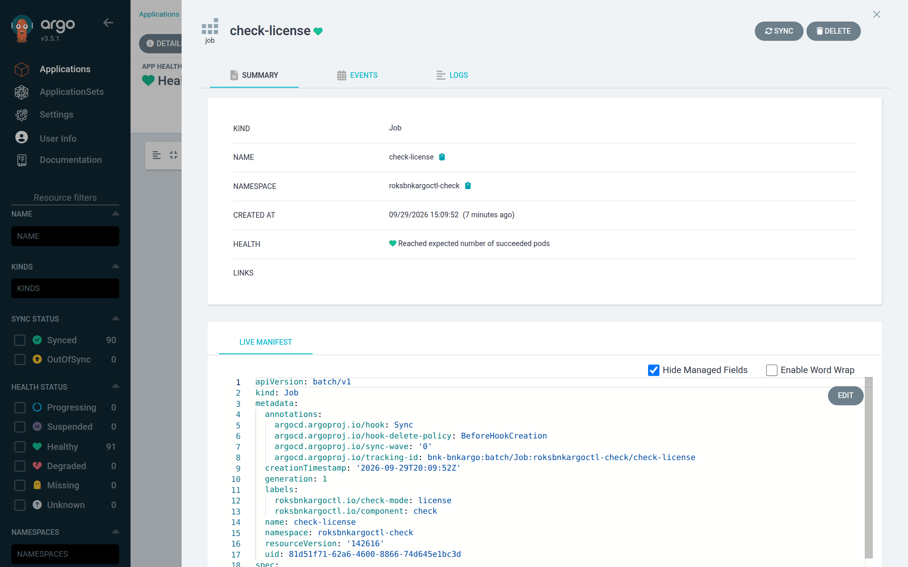

# status and diagnose

This chapter covers the two read-only commands you use while an install is running or after
it has failed: `status`, a one-screen summary, and `diagnose`, a bundle of everything needed
to find a cause. It also explains how to read the JSON verdict line every check prints.
After reading it you will be able to tell which wave an install stopped in and why, without
`kubectl` or `oc`.

Neither command changes anything. Both need the IBM Cloud API key (to fetch the cluster's
admin kubeconfig) and the Argo CD token; if either is missing, the command reports the error
on the relevant line and continues with what it can read.

## status

```sh
roksbnkargoctl status [-w <workspace>]
```

Example output of a finished connected install:

```text
Workspace:       demo
Cluster:         my-roks-cluster
Transit gateway: my-tgw
Mode / registry: connected / far (repo.f5.com)
Git:             https://github.com/example/gitops.git main:bnk/demo
Last published:  3f9c2a17de
Application:     bnk-demo  sync=Synced  health=Healthy
Last operation:  Succeeded — successfully synced (all tasks run)
Checks:
  check-cert-manager-ready     Succeeded
  check-license                Succeeded
  check-post-install           Succeeded
  check-pre-install            Succeeded
CNEInstance:     Available=True …
License:         state=Active …
```

| Field | Source | Meaning |
|---|---|---|
| `Workspace` | workspace | The workspace name |
| `Cluster` | `cluster` | The cluster as written in `config.yaml` |
| `Transit gateway` | `transit_gateway` | As written in `config.yaml` |
| `Mode / registry` | `bnk.mode`, `registry.source` | Plus the image host in parentheses: FAR's host or `<mirror-host>/<prefix>` |
| `Git` | `git.url`, `git.branch`, `git.path` | Where the manifests are published |
| `Last published` | `resolved.last_published_commit` | First 10 characters of the last commit `install` published or confirmed |
| `Application` | Argo CD | Name, `sync=` (Synced, OutOfSync, Unknown) and `health=`; or `not created (run install)`; or the API error |
| `Last operation` | Argo CD | Phase and message of the last sync or delete operation |
| `Checks` | ROKS | Every check Job in `roksbnkargoctl-check` (label `roksbnkargoctl.io/component=check`): `Succeeded`, `Failed` or `Running`, plus the Job condition message if any |
| `CNEInstance` | ROKS | `<bnk.namespace>/<bnk.namespace>-f5-cne-controller` (`f5-bnk/f5-bnk-f5-cne-controller` by default): `state=` if present, then every condition as `Type=Status`; `absent`; or `no status yet` |
| `License` | ROKS | `f5-utils/bnk-license`: `state=` (want `Active`) and conditions; `absent` before the license hook has run |

`Checks` lists Jobs, so it shows the hook checks only. The node probe (a DaemonSet) and the
Gateway API sweep (a Deployment) are pods; their state is in `diagnose`. A hook Job stays
until the next sync or delete replaces it, so after a failure the failed Job is still there
to read.

If the cluster cannot be reached, `status` prints `Cluster access:` with the error and stops
after the Argo CD lines.

## diagnose

```sh
roksbnkargoctl diagnose [-w <workspace>]
```

`diagnose` writes a bundle to `<workspace>/diagnostics/<UTC time>/` (for example
`diagnostics/20260929-141502/`) and prints its path. Start with `summary.md`. No Secret is
read; the `License`'s inline `spec.jwt` is replaced by `REDACTED` before it is written.
All files are mode 0600.

### Files

| File | Contents |
|---|---|
| `summary.md` | The digest; read first (sections below) |
| `application.yaml` | The Application as Argo CD returns it, including `status.operationState` |
| `resource-tree.yaml` | The Application's resource tree: every object Argo CD tracks and its health |
| `pods-<namespace>.yaml` | One entry per pod: name, phase, node, and a one-line problem (empty when healthy) |
| `warnings-<namespace>.txt` | Warning events, sorted, one per line: time, kind/name, reason, message |
| `log-<pod>.txt` | The last 2000 lines of every pod's log in `roksbnkargoctl-check` (every check: hooks, node probes, the sweep, the CA installer) |
| `cneinstance.yaml` | The CNEInstance, if it exists |
| `license.yaml` | The `License`, JWT redacted, if it exists |

The namespaces collected are `roksbnkargoctl-check`, `bnk.namespace`,
`bnk.utils_namespace` (when it differs from `bnk.namespace`) and `cert-manager` (when
roksbnkargoctl installs cert-manager; never in single-certificate mode).

### `summary.md` sections

| Section | What it tells you |
|---|---|
| `# roksbnkargoctl diagnostics — <time>` | When the bundle was taken |
| `## Status` | The full `status` output |
| `## Last Argo CD operation` | Phase and message of the last operation, verbatim |
| `## Hook Jobs (Argo CD's view)` | Every Job in the resource tree merged with the hook results of the last operation: namespace, name, health, message, hook type and hook phase. A hook Job already deleted shows as `Health:Missing` but keeps its hook result |
| `## Pods not Running/Succeeded` | Every pod in the collected namespaces with a problem: a waiting reason such as `ImagePullBackOff`, a non-zero exit, or unschedulable; `none` if there is none |
| `## Check verdicts (last JSON line of each check pod)` | For each check pod, its last JSON line; for node-probe pods, also the `roksbnkargoctl.io/probe-result` annotation |

A practical order of reading: the last operation tells you which hook or wave stopped the
sync; the hook Jobs section names the failed check; its verdict line says why; the pods and
warnings files show the cluster side (image pulls, scheduling, admission); `log-<pod>.txt`
has the full narrative.

## Reading a check verdict

Every check writes human-readable progress to stderr and exactly one JSON line to stdout
when it finishes. Both end up in the pod log; the verdict is the last line that parses as
JSON. The process exits 0 on pass, 1 on fail and 2 on a usage error.

The human lines mark each finding as it happens:

```text
[PASS] license-active: License f5-utils/bnk-license is Active
[INFO] cwc-restart: CWC already trusts this CA (hash …)
[FAIL] cneinstance-available: CNEInstance f5-bnk/f5-bnk-f5-cne-controller not Available within 15m0s (…)
license FAILED:
  cneinstance-available: CNEInstance f5-bnk/f5-bnk-f5-cne-controller not Available within 15m0s (…)
```

The verdict line (reformatted here for reading):

```json
{
  "mode": "license",
  "version": "vX.Y.Z",
  "ok": false,
  "started": "2026-09-29T14:02:11Z",
  "durationSeconds": 912.4,
  "findings": [
    {"check": "license-active", "severity": "pass", "detail": "License f5-utils/bnk-license is Active"},
    {"check": "cneinstance-available", "severity": "fail", "detail": "CNEInstance f5-bnk/f5-bnk-f5-cne-controller not Available within 15m0s (…)"}
  ]
}
```

| Field | Meaning |
|---|---|
| `mode` | Which check: `pre-install`, `node-probe`, `gateway-api-sweep`, `cert-manager-ready`, `cert`, `license`, `post-install`, `pre-uninstall`, `post-uninstall` |
| `version` | The check binary's version; confirms which build the cluster ran |
| `ok` | `true` only if no finding has severity `fail` and there is no `error` |
| `started`, `durationSeconds` | When it began (UTC) and how long it ran |
| `findings[]` | In order: `check` (short name), `severity` (`pass`, `fail`, `warn`, `info`), `detail` (the explanation, usually with the fix) |
| `data` | Optional structured results, for example `webhooksRemoved` (pre-uninstall) or `f5CRDs` and `clusterLeftovers` (post-uninstall) |
| `error` | Set when the check could not run at all, for example no in-cluster credentials |

Read the `fail` findings first; `warn` findings do not fail the check but often explain a
later failure. In `summary.md` a verdict longer than 600 characters is truncated; the full
line is in `log-<pod>.txt`.



*A check hook in the Argo CD UI: the `check-license` Sync hook Job, healthy once it reached its expected succeeded pod. Its Logs tab shows the same findings `status` and `diagnose` read.*

### The node-probe annotation

Each `check-node-probe` pod publishes its report on its own pod annotation
`roksbnkargoctl.io/probe-result`, which `check pre-install` collects from every node:

```json
{"runId":"…","node":"10.243.0.12","pod":"check-node-probe-…","time":"…","ok":false,
 "targets":[{"target":"repo.f5.com:443","tls":true,"ok":false,"dns":"ok","addrs":["…"],
   "tcp":"FAILED","attempts":…,"elapsedSeconds":180.1,"error":"…"}]}
```

| Target field | Values |
|---|---|
| `dns` | `ok`, `FAILED`, or `skipped-ip` for a literal IP |
| `tcp` | `ok`, `FAILED`, or `skipped` |
| `handshake` | `ok` or `FAILED` (TLS targets only) |
| `verified` | `yes`, `no: <why>`, or `skipped (insecure)` for the FLP and a private-CA mirror |
| `certSubject`, `certIssuer` | The server's leaf certificate, reported even when unverified |

A target that fails on the nodes of one zone but not the others usually points to a routing
or security-group problem specific to that zone's subnet.

## See also

- [Checks reference](./16-checks.md) for every finding name
- [Troubleshooting guide](./17-troubleshooting.md)
- [Troubleshooting with an agentic CLI](./18-agent.md), which works from these two commands
- [uninstall](./10-uninstall.md) for the log collector that runs during an uninstall
