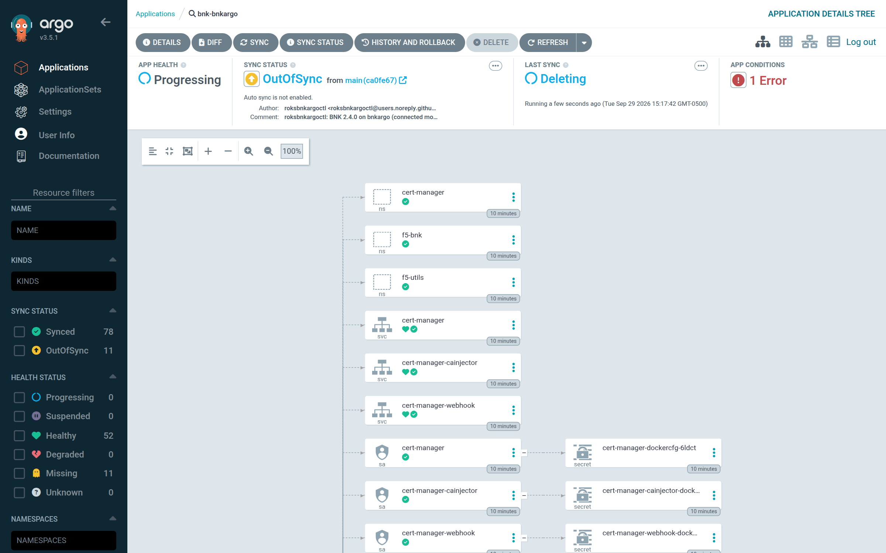

# uninstall

This chapter explains how `roksbnkargoctl uninstall` removes BNK: the order in which the
in-cluster checks drain it, what Argo CD prunes, what the CLI removes afterwards, and what is
deliberately left behind. After reading it you will be able to uninstall cleanly, read the
logs the command saves, and recover an uninstall that stopped part-way.

## Usage

```sh
roksbnkargoctl uninstall [flags] [-y] [-w <workspace>]
```

| Flag | Default | Meaning |
|---|---|---|
| `--timeout` | `45m0s` | How long to wait for Argo CD to finish deleting the Application |
| `--purge-git` | `false` | Also remove `git.path` from the Git repository (one commit) |
| `--keep-trusted-profile` | `false` | Keep the IAM trusted profile |
| `--detach-tgw` | `false` | Detach the cluster VPC from the transit gateway, but only if `install` attached it |
| `--remove-repo` | `false` | Remove the Git repository and the chart registries, with their credentials, from Argo CD (other Applications may use them) |
| `--force` | `false` | Delete the Application even when the pre-uninstall check fails or the cluster cannot be reached |
| `-y`, `--yes` | `false` | Do not ask for confirmation |

`uninstall` asks `Uninstall BNK from <cluster> (Application <name>)? [y/N]`. Without a
terminal and without `--yes` it refuses rather than guessing.

## The sequence

```text
 uninstall (CLI)                        Argo CD                   ROKS
 ───────────────                        ───────                   ────
 start log collector
 run Job check-pre-uninstall-cli  ──────────────────────────────▶ drain F5 CRs while FLO runs,
 and wait (failure: stop here)                                     License, then CNEInstance
 DELETE Application  ─────────────────▶ prune synced objects ───▶ (reverse wave order;
 (cascade, foreground)                  (+ PreDelete/PostDelete    namespaces and CRDs kept)
 wait until it is gone                   hooks, best effort)
 run Job check-post-uninstall-cli ──────────────────────────────▶ CWC secrets, namespaces,
 and wait                                                          stuck F5 finalizers
 verify the BNK namespaces are gone
 remove out-of-band objects  ───────────────────────────────────▶ Secrets, check RBAC and
                                                                   namespace, Argo CD manager SA
 remove cluster registration ─────────▶ cluster Secret on the hub
 delete trusted profile (IBM IAM)
```

The checks are the same `check` container as the Argo CD hooks, taken from the rendered
Jobs in `manifests/git/` with the hook annotations removed and `-cli` added to the name.
`uninstall` runs them itself because Argo CD 3.5.1 can declare a PreDelete or PostDelete
hook finished the moment it creates it
([argoproj/argo-cd#29100](https://github.com/argoproj/argo-cd/issues/29100)). Seen on the
test cluster: the pre-uninstall pod was stopped 0.4 seconds after it started, Argo CD pruned
FLO beneath it, and the post-uninstall hook never ran. The hooks stay in Git, so deleting the
Application from the Argo CD UI still tries them, but only `uninstall` guarantees the
order. Both checks are idempotent: a hook that runs after the CLI's copy finds nothing to do.

### 1. `check pre-uninstall`

BNK's operator (FLO) must outlive the objects it has to finalize. Deleting FLO and the
CNEInstance together leaves F5 finalizers that nothing can clear, and the namespace hangs
in `Terminating`. So before the Application is deleted, the check drains BNK in this order
while FLO is still running:

| Step | What happens | On failure |
|---|---|---|
| FLO check | Reports whether an FLO Deployment is available | Warning only: post-uninstall strips finalizers if namespaces stick |
| Webhook sweep | Deletes F5 validating webhooks (`f5validate-*`, or any served from a BNK namespace) every 3 s and on every refused delete, for the whole check. FLO re-creates them during teardown | — |
| Drain | Deletes every `gateway.k8s.f5.com` and `fic.f5.com` resource in `f5-bnk` and `f5-utils` and waits for them to finalize (15 minutes per namespace, as rendered) | Fails the check; CNEInstance **not** deleted |
| IPAM | Waits until no `fic.f5.com` IPAM/IPAMRange object remains | Fails the check; CNEInstance **not** deleted |
| License | Deletes the `License` and waits up to 3 minutes | Warning only; post-uninstall strips its finalizer |
| CNEInstance | Deletes `f5-bnk-f5-cne-controller` last and waits up to 10 minutes for FLO to finalize it | Fails the check |

Two F5 groups are deliberately not drained. `k8s.f5.com` holds the CNEInstance and the
components FLO derives from it, which FLO re-creates within seconds while the CNEInstance
exists; they go with the CNEInstance. `k8s.f5net.com` holds product defaults that the
webhook refuses to delete or re-creates on sight, plus the `License`, which is deleted
explicitly.

A failed drain leaves the CNEInstance and FLO in place on purpose: deleting the CNEInstance
would orphan exactly the objects still waiting. `uninstall` then stops **without deleting the
Application** and says so. Fix what the check names (its log is saved, see below) and run
`uninstall` again. `--force` deletes the Application anyway; post-uninstall then strips
the F5 finalizers that are left.

If the cluster cannot be reached at all, `--force` only deletes the Application:
`uninstall` then exits with the connection error. No uninstall check runs and nothing out
of band is removed. Re-run `uninstall` once the cluster is reachable; with the Application
gone it goes straight to the post-uninstall check and the cleanup.

### 2. Argo CD deletes the Application

The CLI calls `DELETE /api/v1/applications/<name>?cascade=true&propagationPolicy=foreground`
and waits up to `--timeout` for the Application to disappear, printing progress lines. If
the Application does not exist, it says so and continues with the post-uninstall check, so
a re-run after a partial uninstall finishes the job.



*Argo CD deleting the Application after the CLI's pre-uninstall check has passed: `Last sync` reads `Deleting`, and pruned objects move to `Missing`.*

### 3. Argo CD prunes

Argo CD deletes everything it synced, in reverse wave order: the CNEInstance and
CNEManifest, the issuers, the FLO and cert-manager charts, the networking objects and the
check DaemonSets and Deployment. Two things are skipped: the BNK namespaces, which carry
`Delete=false`, and the charts' CRDs, which carry `helm.sh/resource-policy: keep` (see
[chapter 7](./07-the-application.md#what-argo-cd-must-not-delete)).

### 4. `check post-uninstall`

While any BNK namespace remains, `uninstall` runs the post-uninstall check and waits for it:

| Step | What happens |
|---|---|
| License secrets | Deletes the 34 CWC license secrets in `f5-utils` by exact name (`activationcontext`, `cwcstate`, `licensekey`, `telemetryreport`, …). Leftovers make the next install find a previous activation and not re-activate. Never a prefix sweep: the namespace may hold unrelated secrets |
| Namespaces | Deletes `f5-bnk`, `f5-utils` (one namespace when they are the same), and `cert-manager` if roksbnkargoctl installed cert-manager (never in single-certificate mode). The single-certificate Secrets go with the BNK namespaces |
| Finalizers | Waits up to 15 minutes (as rendered) for the namespaces to go. After 30 seconds, for `f5-bnk` and `f5-utils` only, removes F5 finalizers (`f5.com` / `f5net.com`) from objects still in the namespace, keeping every other finalizer. `cert-manager` is waited for but never stripped |
| Report | Lists F5 CRDs (kept by design) and any cluster-scoped F5 objects or the ClusterIssuers `sample-issuer` / `selfsigned-cluster-issuer` that remain, as information |

A namespace still present after 15 minutes fails the check, with the namespace's
`NamespaceFinalizersRemaining` / `NamespaceContentRemaining` message in the finding.

Then `uninstall` looks for `f5-bnk`, `f5-utils` and (when roksbnkargoctl installed it)
`cert-manager` itself. If any remains it fails with
`BNK is not fully removed: namespaces … remain`, and it does **not** remove the check
namespace, so running `uninstall` again can run the check again. It never prints
`uninstalled` while BNK is still there.

### 5. What the CLI removes afterwards

Once the checks have passed and the BNK namespaces are gone, `uninstall`:

| Removed | Details |
|---|---|
| Out-of-band objects | Read back from `manifests/direct/` and deleted in reverse apply order: the Secrets (pull secret, `bnk-license-jwt`, `licenseserver-rootca`), then the `check` ServiceAccount, ClusterRole and ClusterRoleBindings, then namespace `roksbnkargoctl-check`. The BNK namespaces are skipped: they are the post-uninstall check's to delete |
| Argo CD manager | `kube-system/roksbnkargoctl-argocd-manager-token`, ClusterRoleBinding `roksbnkargoctl-argocd-manager`, ServiceAccount `kube-system/roksbnkargoctl-argocd-manager` |
| Cluster registration | The Argo CD cluster entry for `resolved.argocd_cluster_server` |
| Repository entries | Only with `--remove-repo`: the Git repository and each chart registry the last render's `manifests/application.yaml` names, with the credentials they carry |
| Trusted profile | Its policies, then the profile, unless `--keep-trusted-profile` |
| Transit gateway connection | Only with `--detach-tgw`, and only the connection `install` created (`resolved.tgw_connection_created_id`); a VPC that was already attached stays attached |
| Git content | Only with `--purge-git`: commit `roksbnkargoctl: remove BNK from <cluster>` removes `git.path` |

Deleting an object that is already gone counts as success. Errors in this phase are
collected and reported together at the end, so one failure does not hide the others; re-run
`uninstall` to retry them.

`uninstall` deletes using `manifests/direct/`. Keep the workspace's `manifests/` directory
until the uninstall has finished; if you have re-rendered with a different configuration in
the meantime, the Secrets of the old configuration are not in the list.

## The uninstall log collector

A hook pod is deleted together with the Application, before anyone could read it
afterwards. So for the whole uninstall, `uninstall` collects every check pod's log itself
(its own `-cli` Jobs and any hook Argo CD runs), into:

```text
<workspace>/diagnostics/uninstall-<YYYYMMDD-HHMMSS>/
  log-<pod>.txt        last 2000 lines of each check pod's log
  summary.md           "# uninstall check verdicts": each pod's last JSON line
```

| Mechanism | When |
|---|---|
| Watch | A pod watch on `roksbnkargoctl-check` fetches a pod's log the moment one of its containers terminates. Polling alone missed a check that had nothing to drain and finished between two polls |
| Snapshots | Every 5 seconds while waiting for the Application, every check pod's log is saved |
| Final snapshot | Taken before the CLI deletes the check namespace, and when the wait fails or times out |

`summary.md` marks a pod whose log had no verdict line yet as `(no verdict line in the last
log captured for this pod)`. The CLI prints
`uninstall check logs (N pods) saved to <dir>`. Read verdicts as described in
[status and diagnose](./09-status-and-diagnose.md#reading-a-check-verdict).

## What is intentionally left

| Left behind | Why |
|---|---|
| F5 CRDs | Cluster-scoped and shared by any BNK on the cluster; deleting a CRD deletes every CR of that kind and can hang namespaces. `check post-uninstall` lists them. A reinstall reuses them |
| cert-manager's CRDs | The chart is installed with `crds.keep: true`, so its CRDs carry `helm.sh/resource-policy: keep`, which Argo CD honours on delete. FLO's chart CRDs are kept the same way |
| The Git history, and the manifests themselves unless `--purge-git` | Your repository's history is yours |
| The Argo CD repository entries unless `--remove-repo`: the Git repository credential, and the chart registries with the FAR key or mirror login; SSH known-host entries added from `git.known_hosts_file`; the mirror's CA certificate added for `registry.mirror.ca_file` | Other Applications may use them. `--remove-repo` does not remove the SSH known-host entries or the mirror's CA certificate |
| The transit gateway attachment, unless `--detach-tgw` and `install` made it | Other workloads may depend on the route |
| The mirror CA file on each node (`/etc/containers/certs.d/<host>/ca.crt`, `/etc/docker/certs.d/<host>/ca.crt`) | The `registry-ca-trust` DaemonSet is pruned, but nothing removes the file it wrote |
| The FLP VSI, the test Argo CD hub, the mirror contents, COS objects | Separate components with their own lifecycle: `flp down`, `argocd down` |

On the verified runs (OpenShift 4.21.31, Argo CD 3.5.1), uninstall left the cluster clean
apart from the kept CRDs, and a reinstall on the same cluster worked.

## See also

- [The Argo CD Application](./07-the-application.md)
- [Checks reference](./16-checks.md) for every pre- and post-uninstall finding
- [Troubleshooting guide](./17-troubleshooting.md) for a stuck deletion
- [The F5 License Proxy](./12-flp.md) and [A test Argo CD hub](./15-test-hub.md) for their own teardown
